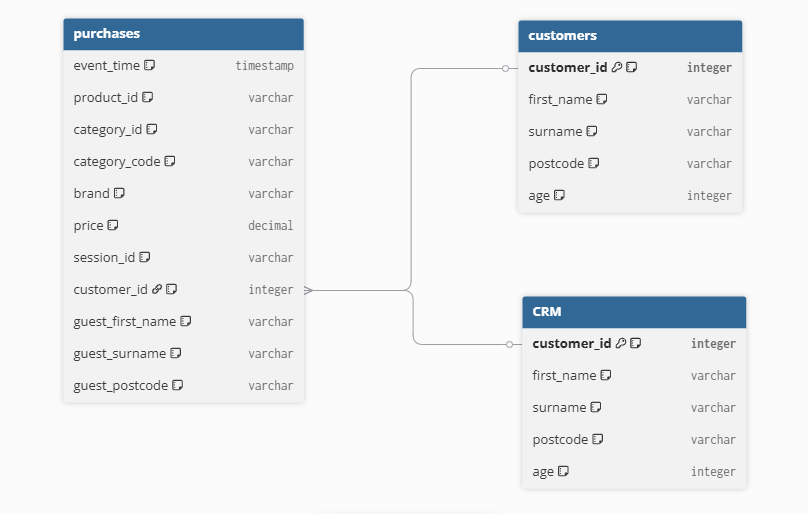
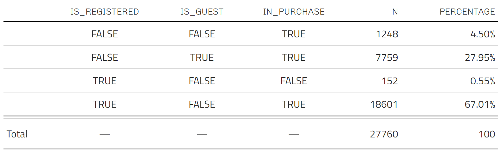

# Project Brief

------------------------------------------------------------------------

> You have been hired by Ebuy Emporium, a new e-commerce startup. They
> have been up and running for a month and have had unexpected success.
> They are starting to have an active interest in their customer base.
> Who are their customers? What do they buy? What drives their
> purchasing behavior? Before they do any serious analysis, however,
> they need to be able to count their customers, which is proving more
> difficult than anticipated. One problem is there are multiple sources
> of customer data , which are:
>
> -   The e-commerce platform’s customer database, where customer
>     details are recorded when they sign up for an account online. This
>     is where most of the customers’ details should be found
>
> -   The in-house CRM system, where customer details are recorded when
>     they make a purchase over the phone or are otherwise onboarded as
>     customers (except as a result of purchasing online with a
>     registered account)
>
> -   The raw transaction data, which we will hereafter refer to as
>     “purchases” or “sales,” and which also contains purchases made “as
>     a guest,” meaning customer records are not explicitly created at
>     the time of purchase

------------------------------------------------------------------------

# Analysis Scope

This a first iteration of our de-duplication problem designed to quickly
solve issue of counting number of customers and nothing more .

------------------------------------------------------------------------

# Results Driven Approach

Goal/Objective : Count Number of Customers

## Understanding the Problem

### 1. "count their customers" :

Came up with a dataset that allows our stakeholders to count all their
customers . Meaning , a dataset that combines all customers that are
spread across multiple databases . Gave our best estimate of a dataset
in which each distinct customer is one record / row , one row per
distinct customer

### 2. kinds of customers

-   Customers that signed up (Registered Online)
-   Customers in CRM system (CRM) customers
-   Customers that made purchases
-   Customers that made purchases as guests (Guest Customers)

### 3. Assumptions based of data

-   Since customers can make purchases as guests , then there is a
    chance a customer made a purchase as a guest then later registered
    then made purchase as registered customer / later made purchase over
    phone . So we can expect duplicates in guests , customer database
    and crm database

-   Also a registered customer may have purchased over phone , so we can
    expect duplicates between crm and customer database

-   In online systems , most systems when a customer is registering they
    can type whatever as their name , also they allowed to make typos ,
    and if same customer made purchase over phone , then entered details
    may differ because of typos and mispellings .

### 4. Plan

1.  ***Explore and validate all datasets*** :

-   Make sure all assumptions about data hold , clean and process e.t.c

2.  ***Decide on the common schema our dataset should have :***

-   The goal is just to count customers, included columns we will use
    for deduplication , columns for data lineage (indicators for each
    data) .
-   Customer details and id (deduplication) then indicator columns for
    data lineage .

3.  ***Separate all possible customers into their own datasets , Add
    customer type indicator variables for data lineage , Remove exact
    duplications then recombine them into one full dataset .***

4.  ***Deduplicate our customers:***

-   meaning we keep one customer from customers with same details but
    different ids . But here we need a column to show all linked_ids
    (dropped customers ids) so when other people use the data model they
    could verify that we indeed removed the right customers / for data
    lineage and transparency

------------------------------------------------------------------------

# Data Landscape

| Data Source                    | Records  | Key Characteristics         |
|--------------------------------|----------|-----------------------------|
| **Purchases**                  | 70,000+  | 25% guest purchases (no ID) |
| **CRM Database**               | 8,000    | Phone/manual onboarding     |
| **Customer Database**          | 24,000   | Online account signups      |
| **Estimated Unique Customers** | \~33,000 | Before deduplication        |

------------------------------------------------------------------------

# Executive Summary

## Key Metrics

| Metric                 | Value   |
|------------------------|---------|
| Initial Records        | \~33K   |
| Final Unique Customers | \~27.8K |
| Duplicates Removed     | \~5.2K  |
| Data Sources Merged    | 3       |

Found **\~27.8K distinct customers** after de-duplication

## Customer Landscape

-   **Customers that made purchases but not registered** : *1248
    customers (4.5%)*

-   **Customers that made purchases as guest** : *7759 customers (28%)*

-   **Customers that registered but did not make purchases** : *152
    customers (0.5%)*

-   **Customers that registered and made purchases** : *18601 customers
    (67%)*

***Registered Customers*** refers to customer that have their **details
in CRM or / and Customer Databases**

------------------------------------------------------------------------

# Customer De-duplication Process Flow

## STEP 1: Data Validation & Cleaning

### Details

-   **Validated 3 data sources:** Purchases (70K+ records), CRM (8K
    customers), Customer Database (24K customers)
-   **Standardized all text fields** to lowercase and trimmed whitespace
-   **Converted dates** to proper datetime format
-   **Identified** 25% of purchases made by guests (no customer_id)
-   **Found** \~33K distinct customers across all sources before
    deduplication

### Key Findings

-   18K purchases with missing customer_id - guest purchases
-   53K purchases with missing customer details - registered/CRM
    customers
-   Confirmed business logic: guests never have IDs, registered
    customers never have inline details

## STEP 2: Data Separation & Schema Design

### Details

-   **Separated customers** into distinct datasets: Guests, Registered
    Purchasers, CRM customers, Customer Database entries
-   **Standardized schema** across all sources with: customer_id,
    first_name, surname, postcode, age
-   **Added data lineage indicators:** is_guest, in_purchase,
    in_crm_base, in_customer_base
-   **Created dummy negative IDs** for guest customers (-1 to -8,200)
    for tracking purposes

### Why This Matters

-   Ensures all customer types can be tracked consistently
-   Dummy IDs allow guests to be included in deduplication process
-   Lineage flags preserve information about where each customer came
    from

## STEP 3: Progressive Data Merging

### Details

-   **Step 1:** Combined guest purchases with registered purchases (base
    dataset)
-   **Step 2:** Left-joined CRM data
    -   Matched 7K out of 7.8K CRM customers to existing records
    -   Added 700 CRM customers who never made purchases
-   **Step 3:** Left-joined Customer Database
    -   Matched 22K out of 23K customers to existing records
    -   Added 1.4K registered customers who never made purchases
-   **Result:** Unified dataset with complete customer information and
    source tracking
-   **Preserved** 1,248 purchase-only customers not found in CRM or
    Customer DB

### Merge Strategy

Each merge preserved all existing data while enriching records with
additional information from new sources. Customer IDs were used as the
primary key, with data lineage flags tracking which systems each
customer appeared in.

## STEP 4: Exact De-duplication

### Details

-   **Identified duplicates** based on exact matches: first_name +
    surname + postcode
-   **Found** 4,500+ customers with duplicate details but different IDs
-   **Created linked_ids lists** to preserve all associated customer IDs
    for audit trail
-   **Kept one record** per unique customer combination
-   **Maintained data lineage** by storing all dropped IDs in linked_ids
    field

## STEP 5: Fuzzy Matching (Advanced)

### Details

-   **Used reclin2 package** for probabilistic record linkage
-   **Blocking strategy:** grouped by postcode to reduce computational
    load
-   **Comparison method:** Jaro-Winkler similarity on first_name and
    surname (handles typos and misspellings)
-   **Scoring threshold:** 1.8 (balance between precision and recall)
-   **Captured variations** like misspellings, abbreviations, and data
    entry errors
-   **Found** 800+ more customers to be duplicates using this method

### Why Fuzzy Matching?

Exact matching misses real duplicates caused by:

-   **Typos:** "Jon Smith" vs "John Smith"

-   **Abbreviations:** "Wm Johnson" vs "William Johnson"

-   **Misspellings:** "Smyth" vs "Smith"

-   **Data entry errors:** Extra spaces, missing letters

## STEP 6: Final Dataset Creation

### Details

-   **Consolidated all linked IDs** from both exact matching and fuzzy
    matching
-   **Added is_registered flag** (TRUE if customer in CRM or Customer
    Database)

Each record includes:

-   **customer_id** - Primary identifier for this customer
-   **first_name, surname, postcode, age** - Customer details
-   **all_linked_ids** - List of all other IDs that belong to this
    customer
-   **is_guest** - Whether customer ever purchased as guest
-   **in_purchase** - Whether customer made any purchases
-   **in_crm_base** - Whether customer in CRM system
-   **in_customer_base** - Whether customer in online database
-   **is_registered** - Whether customer has account (CRM or online)

------------------------------------------------------------------------

# Known Data Quality Issues

1.  **Though our data has no missing product and category id :**

-   We have over 16k+ missing category_codes

-   We have over 5K missing brands of items purchased

-   This suggests possible existence of other databases that may contain
    the missing info

2.  **Ages to young (age 0) and ages too old (100) :**

-   120 in CRM and 330 in Customer database . We need to check these ,
    they may be system errors , or customers did not complete their
    profiles .
-   Do we keep these or do we drop them ?

3.  **Method Used to find duplicates**

-   We assumed that customers with same names and postcode are the same
    . This was due to guest detail not containing age column
-   This is a reasonable assumption , but not as accurate as also
    considering age when finding duplicates .
-   If there is way to get extra detail on guest and registered
    customers , then we can improve the results

------------------------------------------------------------------------

# Next Steps (Possible Improvements)

The goal of this data model was to only count the number of customers .
That is all its useful for right now

1.  **Extra KPI variables for advanced business problems**

-   Data models is only useful for counting customers so it only include
    customers personal details
-   We can add appropriate variable / metrics if stakeholder want to
    solve business problems beyond just counting customers
-   Example , duration of registration and last active date , to see
    which customers are still active and loyal

2.  **Resolve missing category_codes and brand names**

-   We can try to find other source we can use to figure out missing
    brands and category_codes

3.  **Decide What to do with nonsensical age values**

-   Validate and decide what to do with customers with ages too young
    and ages too old

4.  **Try to Improve method of finding duplicates**

-   We try to find even extra information of guest ,CRM and Customer
    Database date that we can use to help de-duplication process . Extra
    information like Emails , Address e.t.c would be very helpful
-   We suggest to make certain info like age , to be required when
    customers make purchases as guest , so we do not have to worry about
    having missing age values for guests in the future
